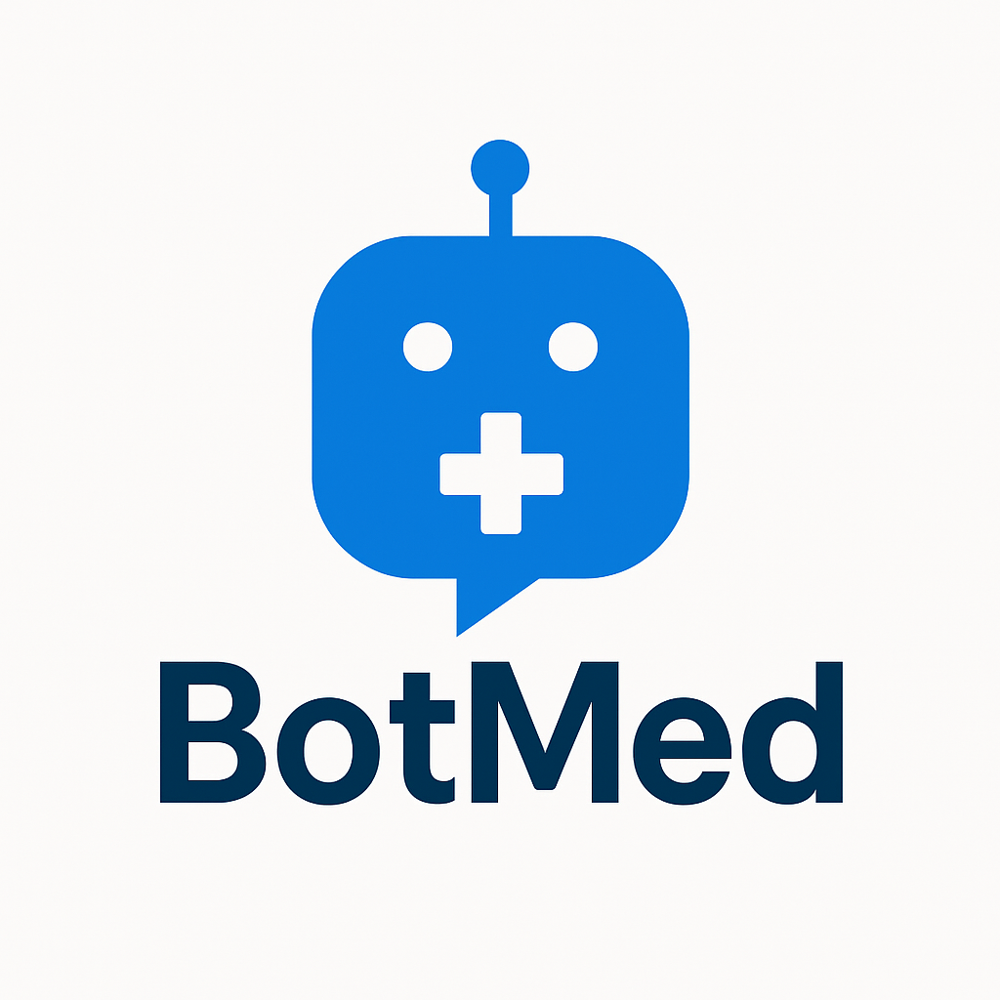

<h1 align="center">
  🧑‍⚕️ BotMed
</h1>

<div align="center">
    
</div>

<p align="center">
  <strong>
  A comprehensive AI-powered medical assistant that provides intelligent health consultations through multiple input modalities including text, voice, and medical image analysis.
  </strong>
</p>

## 🏆 Hackathon Project

This project was developed for the **VITB-JHU Health Hack**, combining cutting-edge AI technologies to create an accessible and intelligent medical consultation platform.

## 📁 Repository Structure

```
BotMed/
├── .github/
│   ├── Assets/
│   │   ├── Contributors/
│   │   │   ├── Rana_Talukdar.png
│   │   │   ├── Bindupautra_Jyotibrat.png
│   │   │   ├── Arunim_Gogoi.png
│   │   │   ├── Ansh_Gaur.jpg
│   │   │   └── Akshit_Joshi.jpeg
│   │   │
│   │   └── logo.png
│   │
│   ├── ISSUE_TEMPLATES/
│   │   ├── bug_report.md
│   │   └── feature_request.md
│   │   
│   ├── CODE_OF_CONDUCT.md
│   └── READMD.md
│
├── Archive/
│   ├── Notebooks/
│   │   ├── API.ipynb
│   │   ├── deepseek_fine_tune.ipynb
│   │   ├── Openai_Whisper_STT_with_NLP.ipynb
│   │   └── Testing.ipynb
│   │
│   ├── Python Scripts/
│   │   ├── aud2text.py
│   │   ├── breath_heart_sound.py
│   │   ├── generate_audio.py
│   │   └── heart_breath_sound.py
│   │
│   ├── Testing Data/
│   │   └── Audio Data/
│   │       ├── OPUS and MP3 Audio Files/
│   │       │   ├── test1.opus
│   │       │   ├── test2.mp3
│   │       │   ├── test3.opus
│   │       │   └── test4.opus
│   │       │   
│   │       └── WAV Audio Files/
│   │           ├── test1.wav
│   │           ├── test2.wav
│   │           └── test3.wav
│   │       
│   └── README.md
│
├── Backend/
│   ├── Notebooks/
│   │   ├── Main Backend/
│   │   │   ├── llama_8b_integrated_aud.ipynb
│   │   │   ├── tumour_class.ipynb
│   │   │   └── whisper_aud_text.ipynb
│   │   │
│   │   └── Speech To Text/
│   │       └── Faster_Whisper_STT_with_NLP.ipynb
│   │
│   └── README.md
│
├── public/
│   └── favicon.ico
│
├── src/
│   ├── App.tsx
│   ├── index.css
│   ├── main.tsx
│   └── vite-env.d.ts
│
├── .gitattributes
├── .gitignore
├── package.json
├── package-lock.json
├── index.html
├── eslint.config.js
├── postcss.config.js
├── tailwind.config.js
├── tsconfig.app.json
├── tsconfig.json
├── tsconfig.node.json
└── LICENSE
```

## 🚀 Features

### Multi-Modal Input Support
- **Text Input**: Direct text-based medical queries
- **Voice Input**: Audio-to-text conversion using OpenAI WhisperX
- **Image Analysis**: Medical image classification for tumor detection

### Advanced AI Capabilities
- **Fine-tuned LLaMA 7B**: Specialized medical knowledge base
- **NLP Health Filter**: Intelligent detection of health-related queries
- **Medical Image Classification**: ML model for tumor type identification
- **Contextual Responses**: Relevant and accurate medical information

## 🛠 Tech Stack

### Backend
- **Python**: Core backend development
- **LLaMA 7B**: Fine-tuned large language model
- **OpenAI WhisperX**: Audio-to-text conversion
- **Custom ML Models**: Image classification and NLP filtering

### Frontend
- **TypeScript**: Type-safe development
- **React**: Component-based UI framework
- **Vite**: Fast build tool and development server
- **HTML5**: Semantic markup
- **Tailwind CSS**: Utility-first styling framework

## 🔧 Installation

### Prerequisites

- [**Python**](https://www.python.org/downloads/) 3.8+ installed
- [**Node.js**](https://nodejs.org/en/download1) 16+ installed
- [`npm`](https://www.npmjs.com/) or [`yarn`](https://yarnpkg.com/) installed
- [**Google Colab**](https://colab.research.google.com/) or [**Kaggle**](https://www.kaggle.com/) Account

### Backend Setup

- The Models must be run on google colab or kaggle for the development setup.
- Clone the repository and navigate to the `backend` directory and then to `Notebooks` directory.
    ```bash
    git clone https://github.com/Jyotibrat/BotMed.git
    cd "backend/Notebooks"
    ```
- Upload the Notebooks to the google colab or kaggle to run them (You can run them in your system also if you have a very good GPU).

**Note:** Currently the Backend is in development and the project is not fully deployed yet.

### Frontend Setup

- Clone the repository and navigate to the root directory.
    ```bash
    git clone https://github.com/Jyotibrat/BotMed.git
    ```
- Install the node modules using npm (you can also download using other package manager like `yarn`).
    ```bash
    npm install
    ```
- If the packages in needing funding.
    ```bash
    npm fund
    ```
- If packages need to be fixed.
    ```bash
    npm audit fix
    ```
- If the fixing of package still persists after running the above command then run this command.
    ```bash
    npm audit fix --force
    ```
- Run the development server.
    ```bash
    npm run dev
    ```
- Open your browser and navigate to `http://localhost:5173/` to see the application.

**Note:** Check the frontend deployment [**here**](https://botmed.netlify.app/)

## 🧪 Model Performance

- **LLaMA 7B Fine-tuning**: Achieved high accuracy on medical query responses
- **Image Classification**: Demonstrates reliable tumor type detection
- **NLP Filter**: Effectively distinguishes health-related vs. non-health queries
- **WhisperX**: High-quality audio transcription with medical terminology support

## 🤝 Contributing

We welcome contributions to improve the BotMed! Please read our [Code of Conduct](CODE_OF_CONDUCT.md) before contributing.

### Development Workflow

1. Fork the repository
2. Create a feature branch (`git checkout -b feature/amazing-feature`)
3. Commit your changes (`git commit -m 'Add amazing feature'`)
4. Push to the branch (`git push origin feature/amazing-feature`)
5. Open a Pull Request

## 📜 License

This project is licensed under the GPL-3.0 License - see the [LICENSE](https://github.com/Jyotibrat/BotMed/blob/main/LICENSE) file for details.

## ⚠️ Disclaimer

**Important**: This medical chatbot is designed for educational and informational purposes only. It should not be used as a substitute for professional medical advice, diagnosis, or treatment. Always consult with qualified healthcare professionals for medical concerns.

## 👥 Team


<p align="center">
  This project was made possible by the contributions of these amazing individuals:
</p>

<div align="center">
  <a href="https://github.com/Arunim-Gogoi">
    
  </a>
  <a href="https://github.com/Lucifer-here">
    
  </a>
  <a href="https://github.com/Auth0r-C0dez">
    
  </a>
  <a href="https://github.com/Jyotibrat">
    
  </a>
  <a href="https://github.com/Akshit7-uni/">
    
  </a>
</div>


## 🙏 Acknowledgments

- VITB-JHU Health Hack organizers
- OpenAI for WhisperX technology
- Meta AI for LLaMA foundation model
- Healthcare professionals who provided domain expertise

## Presentation Link

Get the Presentation for the project [here](https://www.canva.com/design/DAGaCl8VEUw/f7KY3gcnwjrO7k1_1qG6Ng/edit?ui=eyJEIjp7IlAiOnsiQiI6ZmFsc2V9fX0)

## 📧 Contact

**For questions, suggestions, or collaboration opportunities, please reach out to us** [***@here***](mailto:bjyotibrat@gmail.com).